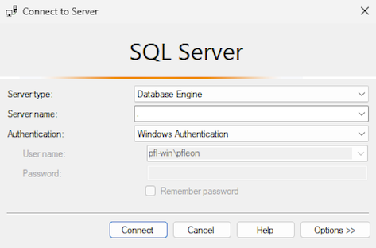
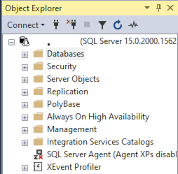
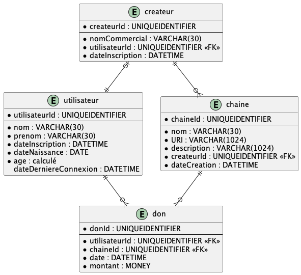

# Module 01 - Introduction

Objectifs :

- Installation d'SQL Server 2019 ou ultérieur
- Installation d'SQL Server Management Studio (SSMS) 18 ou ultérieur
- Création d'une base de données
- Création de tables

## Exercice 1 - Installation des outils - Windows - Complète

### Exercice 1.1 - Installation d'SQL Server - Windows - Complète

- Naviguez l'adresse : [https://www.microsoft.com/en-ca/sql-server/sql-server-downloads](https://www.microsoft.com/en-ca/sql-server/sql-server-downloads) et téléchargez la version "Developer" pour Windows
- Une fois le fichier d'installation téléchargé, installez SQL Server en utilisant les options par défaut

### Exercice 1.2 - Installation d'SQL Server Management Studio

- Naviguez l'adresse : [https://learn.microsoft.com/en-us/sql/ssms/download-sql-server-management-studio-ssms](https://learn.microsoft.com/en-us/sql/ssms/download-sql-server-management-studio-ssms) et téléchargez la version actuelle d'SSMS
- Une fois le fichier d'installation téléchargé, installez SQL Server Management Studio en utilisant les options par défaut

### Exercice 1.3 - Test de l'installation

- Lancez SSMS
- Une fois le logiciel ouvert, essayez de vous connecter sur votre instance SQL :
  - Server type : "Database Engine"
  - Server name : "."
  - Authentication : "Windows Authentication"



- Naviguez l'explorateur d'objets et particulièrement le niveau "Databases"



## Exercice 2 - Création de votre première base de données dans SQL Server

Vous devez créer une première version d'une base de données pour amasser des dons pour des créateurs de contenus.

En équipe, vous êtes arrivé sur une première version du modèle entité-association (Entity Relation) suivant :



- Créez la base de données "M01_Createur"
- Observez le diagramme et déduisez l'ordre de création des tables
- Écrivez les instructions DDL permettant de créer ces tables en tenant compte des containtes suivantes :
  - createur.dateInscription : doivent être <= à la date/heure système
  - utilisateur.dateInscription : doivent être <= à la date/heure système
  - utilisateur.dateNaissance : l'utilisateur doit au moins avoir 13 ans
  - utilisateur.age : champ calculé automatiquement
  - utilisateur.dateDerniereConnexion : doit être inférieure ou égale à la date/heure système
  - chaine.URI : doit débuter par "http://" ou "https://"
  - chaine.dateCreation : doit être inférieure ou égale à la date/heure système
  - don.date : doit être inférieure ou égale à la date/heure système
  - don.montant : doit être supérieur à 1
  - Les noms, prenoms, noms commerciaux doivent avoir au moins 3 caractères de long sans espace
- Écrivez des instructions DML afin d'insérer des données dans les tables et de tester les contraintes

<details>
    <summary>Calcul de l'âge à partir de la date de naissance</summary>

S'inspirer du code extrait d'une réponse sur [ce site web](https://learn.microsoft.com/en-us/answers/questions/481579/how-to-calculate-age-from-date-of-birth.html) :

```sql
SELECT *,  
     CASE 
         WHEN MONTH(GETDATE()) > MONTH(date_birth) OR MONTH(GETDATE()) = MONTH(date_birth) AND DAY(GETDATE()) >= DAY(date_birth) THEN DATEDIFF(year, date_birth, GETDATE()) 
         ELSE DATEDIFF(year, date_birth, GETDATE()) - 1 
     END AS age
 FROM [User];
```

</details>

<details>
    <summary>Contrainte sur l'âge</summary>

Vous ne pouvez pas vous fier sur la colonne calculée pour valider l'âge car nous ne voulons pas stocker cette information. Vous allez donc devoir utiliser la fonction [```DATEADD```](https://learn.microsoft.com/en-us/sql/t-sql/functions/dateadd-transact-sql) pour ajouter - 13 ans à la date système et faire votre comparaison sur cette date.

</details>

<details>
    <summary>Contrainte sur les noms, etc.</summary>

Regardez les documentations des fonctions suivantes [```TRIM```](https://learn.microsoft.com/en-us/sql/t-sql/functions/trim-transact-sql) et [```LEN```](https://learn.microsoft.com/en-us/sql/t-sql/functions/len-transact-sql)

</details>

<details>
    <summary>Contrainte sur l'URI</summary>

Si ca ne fonctionne pas avec une seule comparaison [```LIKE```](https://learn.microsoft.com/en-us/sql/t-sql/language-elements/like-transact-sql) essayez avec deux et un opérateur logique.

</details>