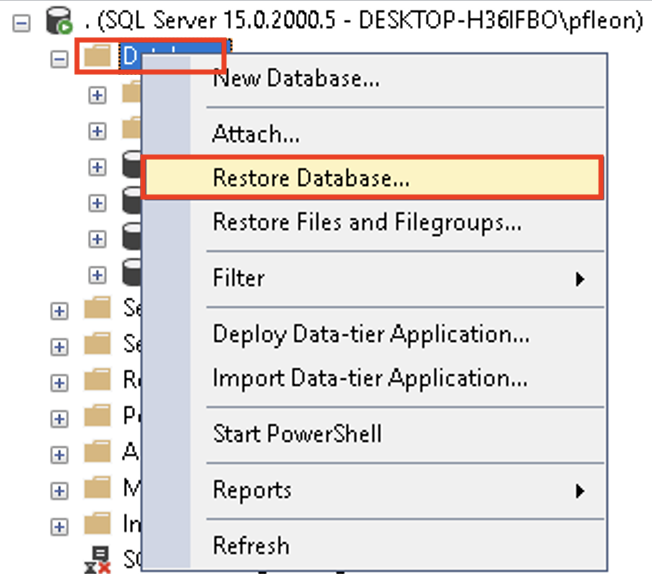
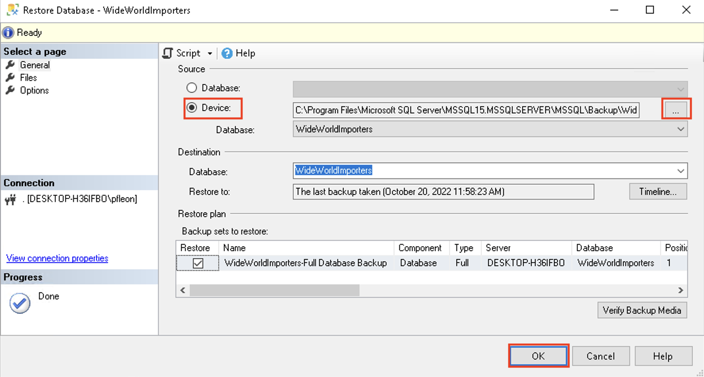
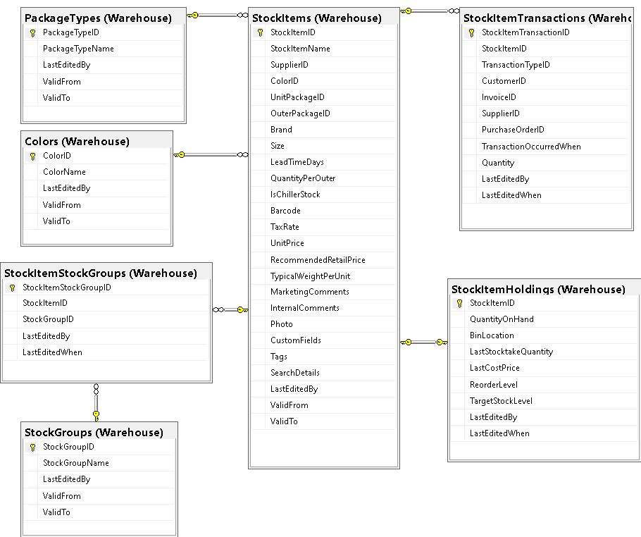

# Module 03 - Langage de manipulation de données

Dans ce module, vous allez devoir dessiner les étapes d'exécutions de requêtes sur des exemples simples afin de valider votre compréhension de l'ordre des exécutions des différentes parties de l'instruction ```SELECT```.

Vous allez ensuite devoir installer la base de données "Wide World Importers" provenant des bases de données exemple de Microsoft.

La base de données "Wide World Importers" est décrite dans la documentation :

- [Informations générales](https://learn.microsoft.com/en-us/sql/samples/wide-world-importers-what-is)
- [Description des schémas et des tables](https://learn.microsoft.com/en-us/sql/samples/wide-world-importers-oltp-database-catalog)
- [Génération de données jusqu'à la date courante](https://learn.microsoft.com/en-us/sql/samples/wide-world-importers-generate-data)

## Préalable 1 - Restoration de la base de données "Wide World Importers"

### Préalable 1.1 - Téléchargement de la base de données

- Téléchargez le [fichier zip ici](https://1drv.ms/u/s!AmZSjqmP5Ux1kaQW7lYjSAsH89pDmw?e=XTOVOG)
- Désarchivez le fichier dans le répertoire ```C:\Program Files\Microsoft SQL Server\MSSQL15.MSSQLSERVER\MSSQL\Backup```

### Préalable 1.2 - Restoration de la base de données

- Lancez SSMS et connectez-vous à votre SGBD
- À partir de l'explorateur d'objets, faites un clic droit sur l'option "Databases" et choisissez "Restore Database..."

- Dans la nouvelle fenêtre, sélectionnez l'option "Device" et spécifiez le chemin de votre fichier à restaurer grâce à l'option "..."
- La base de données ainsi que le plan de restauration vont s'afficher en dessus du chemin du fichier : cliquez simplement sur le bouton "OK"

- SSMS devrait vous indiquer que la restauration a été effectuée avec succès

## Exercice 1 - On expérimente le papier

Soit les tables "etudiant", "cours" et "etudiant_cours" :

| **etudiantId** | **prenom** | **nom**   |
|----------------|------------|-----------|
| 1              | Marie      | Vière     |
| 2              | Alex       | Terrieur  |
| 3              | Alain      | Terrieur  |
| 4              | Gille      | Éparballe |
| 5              | Alain      | Verse     |

| **coursId** | **titre**                             |
|-------------|---------------------------------------|
| 1           | Philosophie                           |
| 2           | Introduction à la productivité        |
| 3           | Viennoiserie - Spécialité Chocolatine |

| **etudiantId** | **coursId** | **dateDebut** | **dateFin** | **noteFinale** |
|----------------|-------------|---------------|-------------|----------------|
| 1              | 3           | 2022-08-29    | NULL        | NULL           |
| 2              | 3           | 2022-08-29    | NULL        | NULL           |
| 3              | 3           | 2022-08-29    | NULL        | NULL           |
| 4              | 3           | 2022-01-03    | 2022-06-06  | 54             |
| 5              | 3           | 2022-01-03    | NULL        | NULL           |
| 5              | 3           | 2022-08-29    | NULL        | NULL           |
| 1              | 1           | 2022-01-03    | 2022-06-06  | 81             |
| 2              | 1           | 2022-01-03    | 2022-06-06  | 50             |
| 3              | 1           | 2022-01-03    | 2022-06-06  | 75             |
| 4              | 1           | 2022-01-03    | 2022-06-06  | 45             |
| 5              | 1           | 2022-01-03    | NULL        | NULL           |

- Sur papier, écrivez les requêtes suivantes et illustrez-les comme dans le cours :

  - Affichez le titre de tous les cours qui contiennent la lettre 'c' dans le titre
  - Affichez les étudiants qui suivent au moins deux cours avec le nombre de cours suivi (dateFin IS NULL)
  - Affichez le nombre de cours réussis pour chaque étudiant
  - Affichez la liste des cours suivis par au moins un étudiant pour la session qui a débuté le '2022-08-29'

- Ouvrez SSMS et implantez les tables et les données dans la base de données 'M03_Exercice1'
- Testez vos requêtes précédentes

## Exercice 2 - Wide World Importers - Warehouse

Voici une extraction des tables contenues dans le schéma "Warehouse" avec lequel vous allez travailler. Pour plus de détails, vous pouvez [vous référer à la référence ici](../BDs/README.md).



- Analysez les champs de la table "Warehouse.StockItems"
- Écrivez les requêtes suivantes à partir du schéma "Warehouse" :
  - Affichez l'ensemble des produits donc la quantité disponible est supérieure à 500000
  - Affichez l'ensemble des produits qui ont au moins deux groupes
  - Affichez l'ensemble des produits qui n'ont pas de groupe

## Exercice 3 - Wide World Importers - Sales

- Connectez-vous à votre SGBD avec SSMS
- À partir de l'option "Database Diagrams" de la base de données "Wide World Importers", créez un diagramme qui contient la table "Invoices" et "Orders" et ses dépendances directes du schéma "Sales".
- Écrivez les requêtes suivantes :
  1. Affichez les commandes non facturées
  2. Comptez le nombre de commandes non facturées
  3. Prenez l'identifiant d'une de ces commandes et affichez le détail de la commande avec le total avant taxes et après taxes
  4. Affichez le chiffre d'affaire non facturé
  5. Affichez le chiffre d'affaire non facturé par année
  6. Affichez le chiffre d'affaire non facturé par année et par mois
  7. Affichez les commandes de plus de 3 articles qui ne sont pas facturées
  8. Affichez la facture 4242 avec son détail (+ montant sans et avec taxes)
  9. À partir de votre précédente requête, trouvez une manière d'insérer le résultat dans la nouvelle table "Facture_4242" (Ne pas faire d'INSERT ici voir [SELECT ... INTO](https://learn.microsoft.com/en-us/sql/t-sql/queries/select-into-clause-transact-sql))
  10. Créez une nouvelle table dans le schéma "Sales" qui s'appelle "InvoicesCache" qui permettra d'ajouter de l'information aux factures sans toucher aux tables d'origines. Elle doit contenir, en plus des informations de liaisons :
      1. Le montant total des taxes
      2. Le montant de la facture avant et après taxes
   11.  Écrivez une requête d'insertion qui remplit la nouvelle table
   12.  Ajoutez une clause à votre requête qui vous évite les erreurs d'insertion à la deuxième exécution de la requête.

## Exercice 4 - Importation des données #1 - Zonage municipal - Zones

### Exercice 4.1 - Préparation de l'importation

1. Naviguez le site [Zonage municipal - Zones](https://www.donneesquebec.ca/recherche/dataset/vque_56/resource/36afc3b9-a6d5-447f-93fa-443f44e94b7c) et téléchargez le fichier CSV
2. Placez le fichier dans le répertoire 'C:\DFC-Info\S3\420-W34-SF\M03\Data'
3. Dupliquez deux fois ce fichier et nommez les copies : ```vdq-zonagemunicipalzones_01.csv``` et ```vdq-zonagemunicipalzones_02.csv```
4. Modifiez les deux fichiers dans Visual Studio Code de telle sorte que :
   1. Fichier ```vdq-zonagemunicipalzones_01.csv```
      1. Supprimez les lignes 2 à 6
   2. Fichier ```vdq-zonagemunicipalzones_02.csv```
      1. Supprimez les 5 dernières lignes de données
5. Créez la base de données "M03_Exercice4" et placez vous dedans
6. Créez les tables ```importation_vdq_zonagemunicipalzones_01``` et ```importation_vdq_zonagemunicipalzones_02``` avec les colonnes ```ID```, ```SUPERFICIE```, ```PERIMETRE``` de type ```VARCHAR(8000)``` et ```GEOMETRIE``` de type ```VARCHAR(max)```

### Exercice 4.2 - Importation de nos fichiers CSV

1. Importez les données des deux fichiers dans les tables éponymes. Pour cela, utilisez la requête suivante pour le premier fichier et adaptée-là pour le deuxième fichier :

```sql
BULK INSERT importation_vdq_zonagemunicipalzones_01
FROM N'C:\DFC-Info\S3\420-W34-SF\M03\Data\vdq-zonagemunicipalzones_01.csv'
WITH
(
        FORMAT='CSV',
        FIRSTROW=2
)
```

2. Validez que les deux tables contiennent bien les données
3. Essayez la requête suivante qui convertit la chaine de caractères de la géométrie dans le type ```geometry``

```sql
SELECT [ID]
      ,[SUPERFICIE]
      ,[PERIMETRE]
      ,GEOMETRY::Parse([GEOMETRIE]) AS GEOMETRIE
FROM importation_vdq_zonagemunicipalzones_01
```

4. Allez dans l'onglet "Spacial results" et observez l'affichage.

### Exercice 4.3 - Fusion de données

1. Créez la table ```zonageMunicipal``` qui contient tous les champs sus-mentionnés mais avec les bons types de données
2. Lisez [la documentation de l'instruction ```MERGE```](https://learn.microsoft.com/en-us/sql/t-sql/statements/merge-transact-sql) et appliquez la fusion de la table ```importation_vdq_zonagemunicipalzones_01``` dans la table ```zonageMunicipal```
3. Dans votre instruction ```MERGE```, ajouter le paramètre ```OUTPUT``` si ce n'est pas déjà fait avec le code suivant : ```OUTPUT deleted.*, $action, inserted.*```
4. Effectuer la même chose pour la deuxième table d'importation. Posez-vous les questions suivantes :
   1. Qu'avez-vous fait des enregistrements présents dans la source mais pas dans la destination ?
   2. Qu'avez-vous fait des enregistrements présents dans la destination mais pas dans la source ?
   3. Comment réagissez-vous l'action à prendre si la zone existe ?
5. Modifiez votre fichier SQL afin que vous puissiez l'exécuter sans erreur à chaque exécution : la BD doit être supprimée et recréée à chaque exécution par exemple
